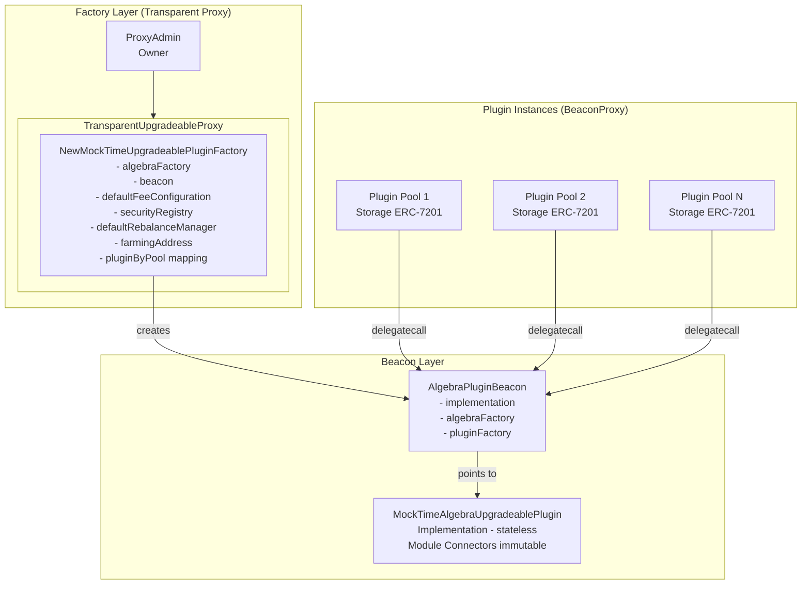
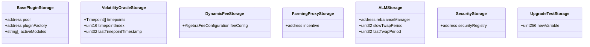
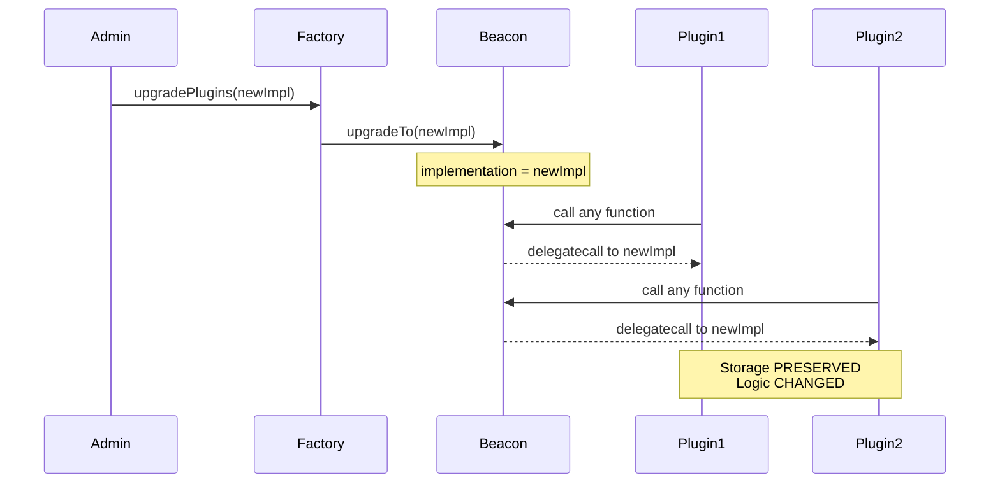
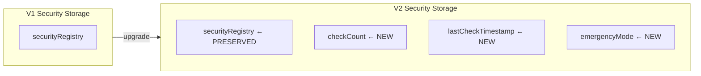
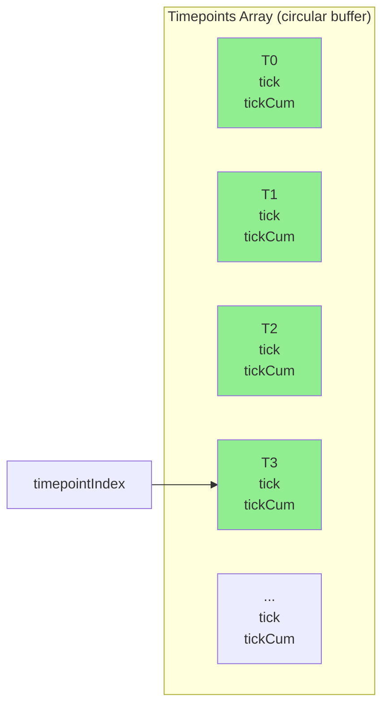
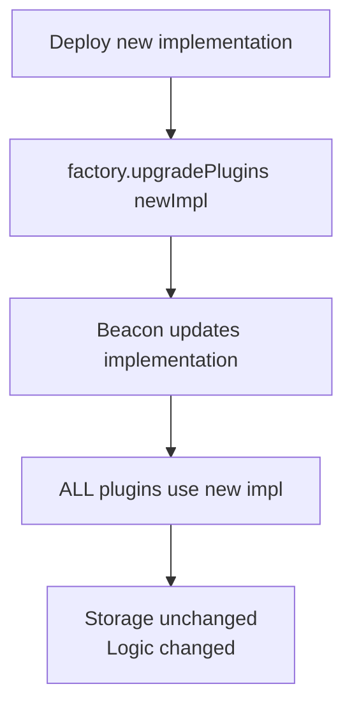
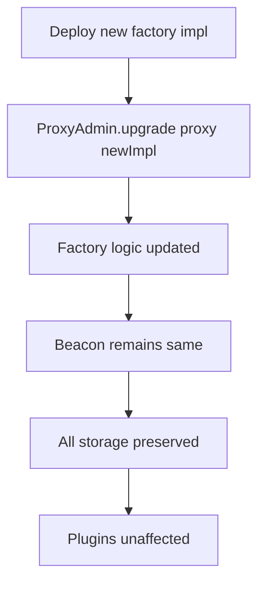
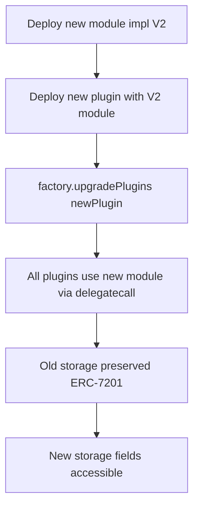

# NewMockTimeUpgradeablePluginFactory Tests

This test suite covers the upgradeable plugin architecture based on the **Beacon Proxy Pattern** with **Transparent Upgradeable Proxy** for the factory.

## Test Files Structure

| File | Description |
|------|-------------|
| `NewMockTimePluginFactory.spec.ts` | Full test suite (all tests in one file) |
| `NewMockTimePluginFactory.basic.spec.ts` | Basic functionality tests |
| `NewMockTimePluginFactory.configuration.spec.ts` | Configuration setters tests |
| `NewMockTimePluginFactory.upgrade.spec.ts` | Upgrade flow tests |
| `NewMockTimePluginFactory.security.spec.ts` | Security module tests |
| `NewMockTimePluginFactory.oracle.spec.ts` | Volatility Oracle tests |
| `shared/fixtures.ts` | Shared test fixtures |

---

## Architecture Overview

---

## ERC-7201 Namespaced Storage

| Namespace | Contains |
|-----------|----------|
| `algebra.storage.baseplugin` | pool, pluginFactory, activeModules |
| `algebra.storage.volatilityoracle` | timepoints[], timepointIndex, lastTimepointTimestamp |
| `algebra.storage.dynamicfee` | feeConfig struct |
| `algebra.storage.farmingproxy` | incentive address |
| `algebra.storage.alm` | rebalanceManager, slowTwapPeriod, fastTwapPeriod |
| `algebra.storage.security` | securityRegistry |
| `algebra.storage.upgradetest` | newVariable (MockUpgradedPlugin only) |

---

## Test Suites

### 📁 NewMockTimePluginFactory.basic.spec.ts

| Test Suite | Tests |
|------------|-------|
| **#Transparent Proxy Pattern** | Factory deployed as proxy, correct algebraFactory, beacon exists, impl not initializable |
| **#Factory Upgrade via ProxyAdmin** | ProxyAdmin can upgrade, storage preserved |
| **#Plugin Creation** | Creates plugin, correct fee config, no duplicates |
| **#Plugin Creation with ALM & Security** | Plugin receives ALM/security config |
| **#Plugin Upgrade via Beacon** | Implementation accessible, can upgrade, storage preserved |

---

### 📁 NewMockTimePluginFactory.configuration.spec.ts

| Test Suite | Tests |
|------------|-------|
| **#ALM Configuration** | `setDefaultRebalanceManager`, `setDefaultAlmTwapPeriods`, events, validation |
| **#Security Configuration** | `setSecurityRegistry`, events |
| **#Fee Configuration** | `setDefaultFeeConfiguration`, events |
| **#Farming Configuration** | `setFarmingAddress`, events, no duplicate |

---

### 📁 NewMockTimePluginFactory.upgrade.spec.ts

| Test Suite | Tests |
|------------|-------|
| **#Complete Plugin Upgrade Flow** | Single upgrade affects ALL plugins, ALL storage preserved, new/old functions work |
| **#Complete Factory Upgrade Flow** | Beacon preserved, ALL configs preserved, existing plugins unaffected |

#### Plugin Upgrade Flow

---

### 📁 NewMockTimePluginFactory.security.spec.ts

| Test Suite | Tests |
|------------|-------|
| **#Security Module Upgrade** | Registry preserved, V2 functions available, new storage alongside old, emergency mode |

#### Security Storage Evolution

---

### 📁 NewMockTimePluginFactory.oracle.spec.ts

| Test Suite | Tests |
|------------|-------|
| **#Volatility Oracle Preservation** | timepointIndex preserved, lastTimestamp preserved, timepoints array preserved, can write new, TWAP works |

#### Oracle Data Structure

---

## Mock Contracts

| Contract | Purpose |
|----------|---------|
| `MockTimeAlgebraUpgradeablePlugin` | Plugin with `advanceTime()` for time manipulation |
| `MockUpgradedPlugin` | Upgraded plugin (extends `AlgebraUpgradeablePlugin`) |
| `MockTimeUpgradedPlugin` | Upgraded plugin with `advanceTime()` |
| `MockUpgradedPluginWithNewSecurity` | Plugin with V2 security module |
| `MockUpgradedSecurityPluginImplementation` | V2 security with new storage fields |
| `MockSecurityRegistry` | Mock for `ISecurityRegistry` |
| `MockPool` | Mock pool for testing |
| `MockFactory` | Mock Algebra factory |

---

## Key Upgrade Flows

### Plugin Upgrade (via Beacon)

### Factory Upgrade (via ProxyAdmin)

### Module Upgrade (e.g., Security)

